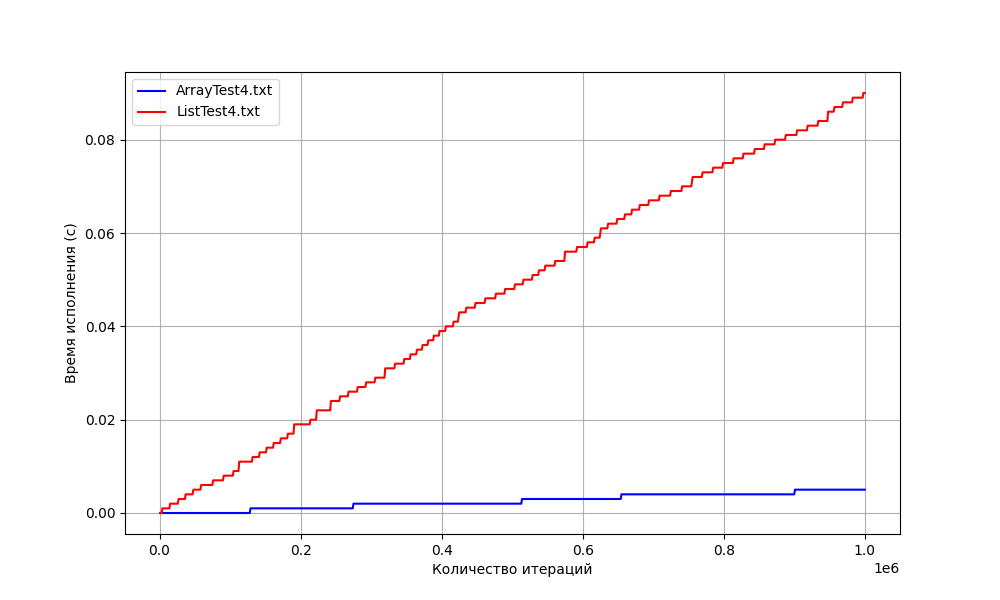

# Практическая работа 2. "Сравнение скорости работы динамического массива и односвязного списка"

## Среднее время работы по трём первым тестам
|     | Стек на списке: | Стек на массиве: |
| :--- | :---: | :---: |
| test 1: | 0.183000s | 0.024000s |
| test 2: | 0.394000s | 0.063000s |
| test 3: | 0.066000s | 0.025000s |
   

## Вывод
Анализируя график, построенный при прохождении теста 4, сделаем вывод, что использование стека на массиве ***гораздо более эффективно***, нежели использование стека на списке.  

При малейшем увеличении количества итераций цикла вставки нового элемента в стек видим все большую разницу во времени исполнения в пользу структуры ArrStack.  
Использование стека на массиве обычно более эффективно по двум важным причинам:

1. **Быстрый доступ к элементам**: При использовании стека на массиве доступ к элементам осуществляется за константное время, так как элементы хранятся в непрерывной области памяти и не требуется дополнительного времени на поиск элемента.

2. **Эффективное использование памяти**: В отличие от списка, массив требует меньше памяти для хранения элементов стека, так как не требуется дополнительное выделение памяти под указатели на следующий элемент.  

Итого вывод: **стек на массиве лучше как в плане времени работы, так и по объему потребляемой памяти**.  
