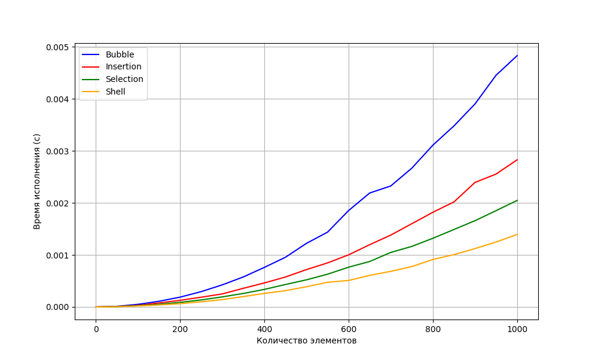
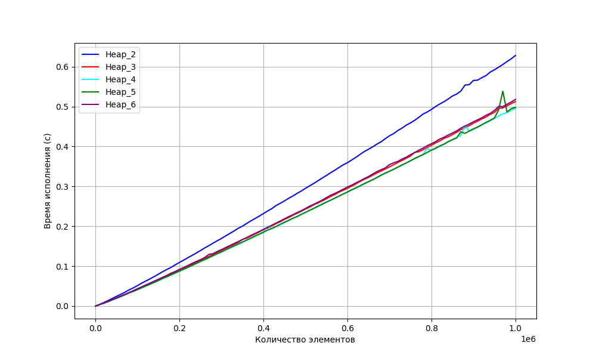
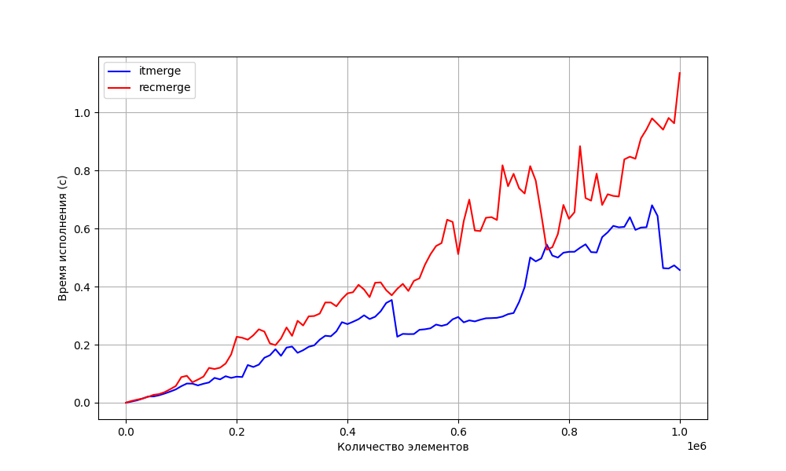
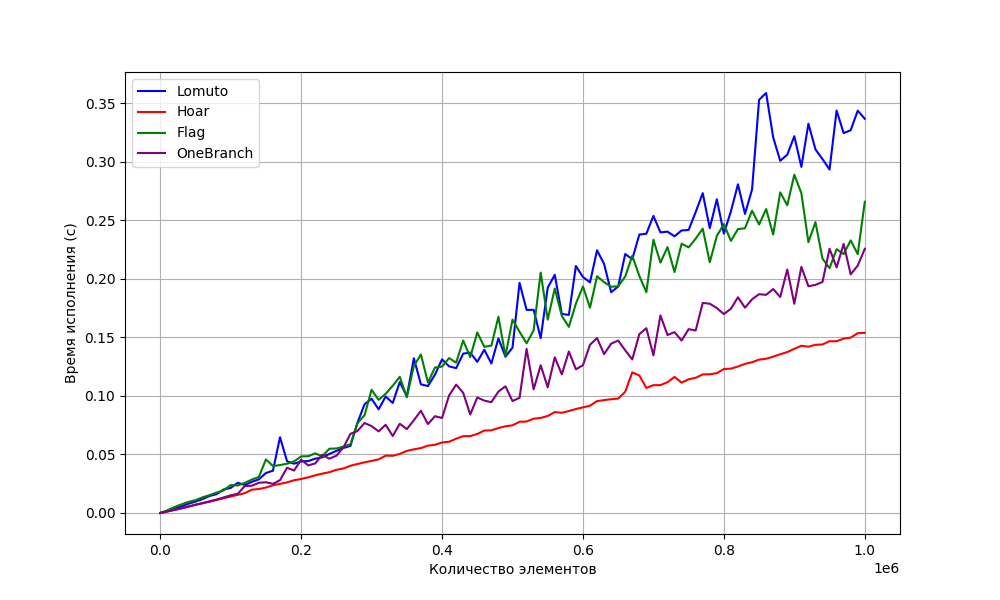
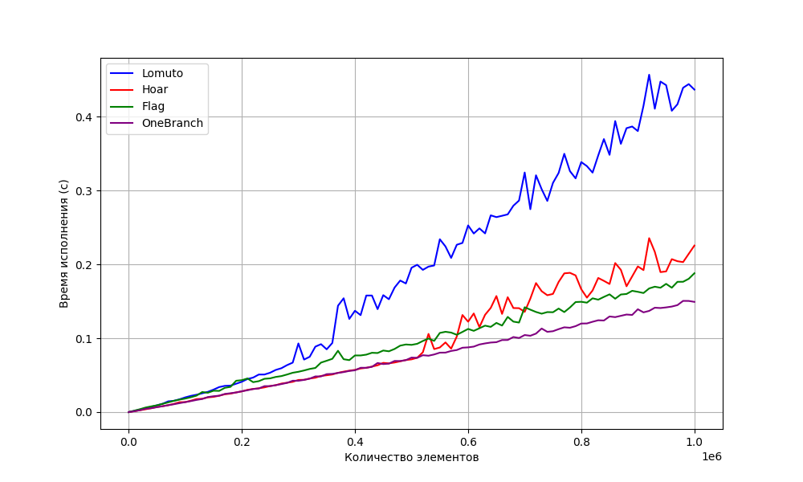
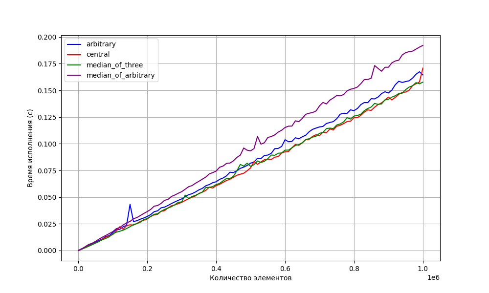
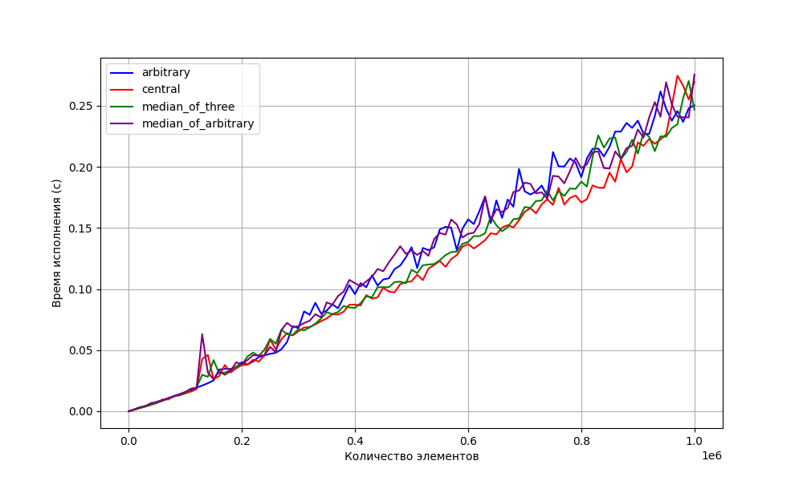
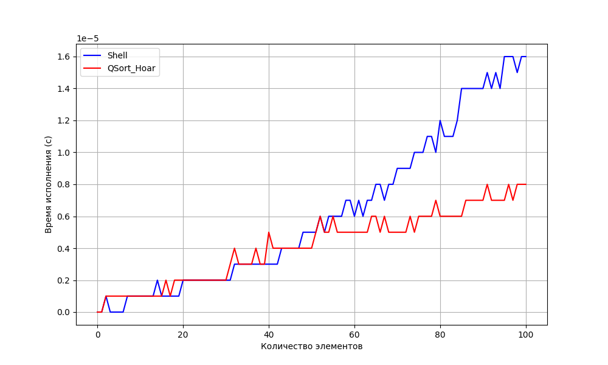
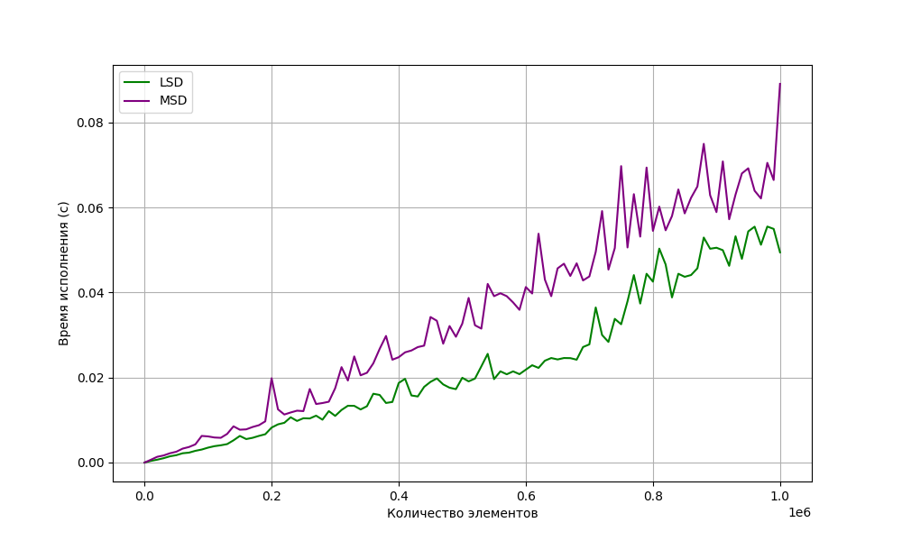
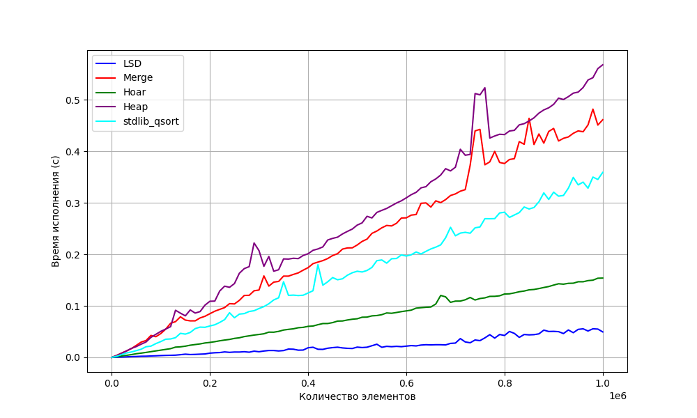

# Практическая работа 3. "Cравнение сортировок"

## Пункт 1
Квадратичные сортировки  
Имеем сортировку Шелла, как наиболее выигрышный вариант, засчет идеи потенциального уменьшения количества инверсий более чем на 1 за одну перестановку элементов. 

## Пункт 2
Сортировка кучей  
Замеряя время работы пирамидальной сортировки для разного количества детей, приходим к наблюдению, что оптимальное количество потомков варьируется от 3 до 5. 

## Пункт 3
Сортировка слиянием  
Итеративная сортировка слиянием работает эффективнее своей рекурсивной реализации засчет минимизации переходов в работе процессора.  

## Пункт 4
Быстрая сортировка. Стратегии партиционирования  
Замеры для набора данных big_tests:  

Замеры для набора данных dub(dublicates)_tests:  

## Пункт 5
Быстрая сортировка. Стратегии выбора опорного элемента  
Замеры для набора данных big_tests: 

Замеры для набора данных dub(dublicates)_tests:    

## Пункт 6
Выбор размера блоков для Introsort  

Имеем график:

Для четкости пришлось немного уменьшить количество тестов. Оптимальный блок - место пересеченния графика быстрой сортировки и сортировки Шелла. По замерам установим, что он равен приблизительно 50 элементов.

## Пункт 8
Сортировки LSD и MSD  

По графику видим, что сортировка LSD эффективнее MSD.  
Это связано с тем, что LSD начинает сортировку с младших разрядов, а MSD с самых старших. Поэтому ключи с одинаковыми старшими разрядами в сортировке LSD не меняют своё положение относительно друг друга, что увеличивает эффективность.

## Пункт 9
**Вывод**  
Имеем график самых быстрых сортировок из каждого пункта лабораторной работы.  

Отметим, что **самой быстрой сортировкой** становистя ***LSD Radix Sort***.
Скорость является ее самым большим преимуществом, потому что это алгоритм без ветвей. Это делает LSD Radix sort самым быстрым из возможных алгоритмов сортировки для относительно коротких ключей фиксированной длины.

Далее идет ***быстрая сортировка***. В ней используется метод партиционирования Хоара и способ выборки pivot там - взятие центрального элемента.
Она обгоняет библиотечную функцию qsort засчёт:
1) Разбиения массива: Сортировка Хоара использует более эффективный алгоритм разбиения массива на подмассивы, чем qsort, что позволяет ей быстрее сортировать большие массивы данных.

2) Меньшего количества обменов: В среднем быстрая сортировка Хоара требует меньшее количество обменов элементов, чем qsort, что позволяет ей работать быстрее на практике.

3) Эффективности памяти: Хоар более эффективно управляет памятью, так как не требует дополнительного массива для разделения элементов, в отличие от qsort.

Медленнее же всего работают сортировки ***слиянием*** и ***кучей***, т.к из-за большого объема данных возникают некоторые проблемы с использованием памяти. Поскольку эти сортировки работают по принципу разделения и объединения данных, большие массивы могут приводить к медленной работе из-за большого количества операций чтения и записи памяти. 
В случае сортировки кучей, построение кучи из большого массива может занимать длительное время из-за большого количества операций перестройки.

Итого, стандартную функцию сортировки удалось превзойти на тестах выбранного размера.

Процессор, используемый при вычислениях: 11th Gen Intel(R) Core(TM) i5-11300H
