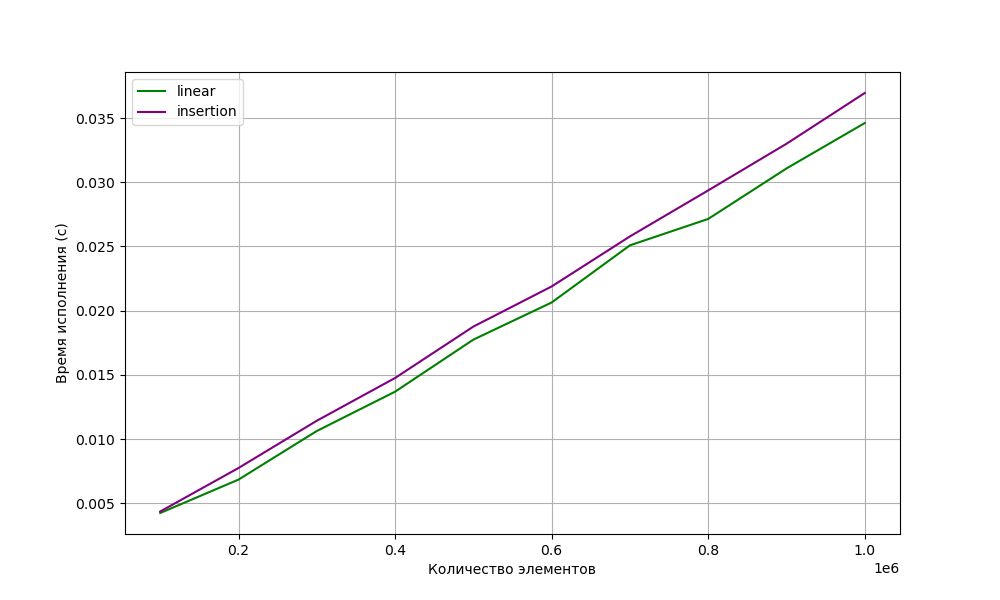

# Практическая работа 4. "Кучи"
Имеем график, построенный по требованиям пункта 1 для бинарной кучи (построение вставками и построение за линию)  

   

## Вывод  
В ходе проведенной лабораторной работы было установлено, что построение кучи на больших размерах за линию происходит быстрее, чем обычными вставками.  

Самое главное - время выполнения: время выполнения алгоритма построения кучи имеет сложность O(nlogn), в то время как для обычных вставок эта сложность составляет O(n^2). На больших размерах количество операций для построения кучи значительно меньше, что приводит к более быстрому завершению алгоритма.  

Вероятно, мною был реализован алгоритм, выдающий слишком большую константу выполнения для построения кучи линией. Из-за этого разница между графиками меньше, чем ожидалось.  

Таким образом, в результате проведенной лабораторной работы было показано, что построение кучи на больших размерах за линию происходит быстрее, чем обычными вставками, засчет меньшего времени выполнения.  

Итого вывод: **построение кучи за линию эффективнее, чем построение вставками**.  
