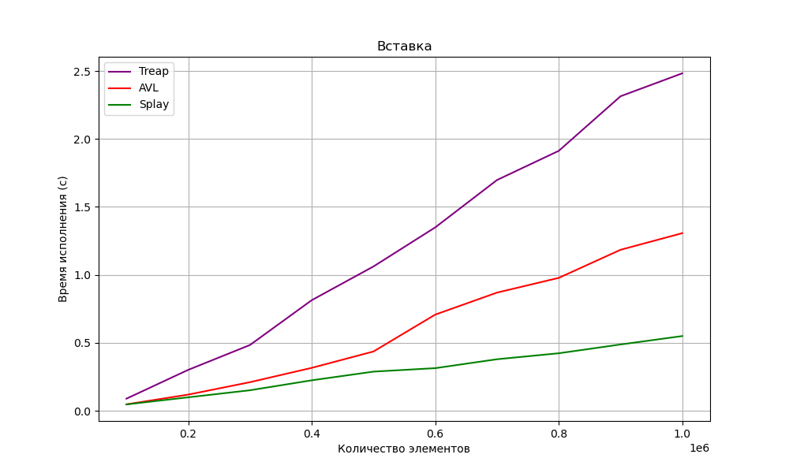
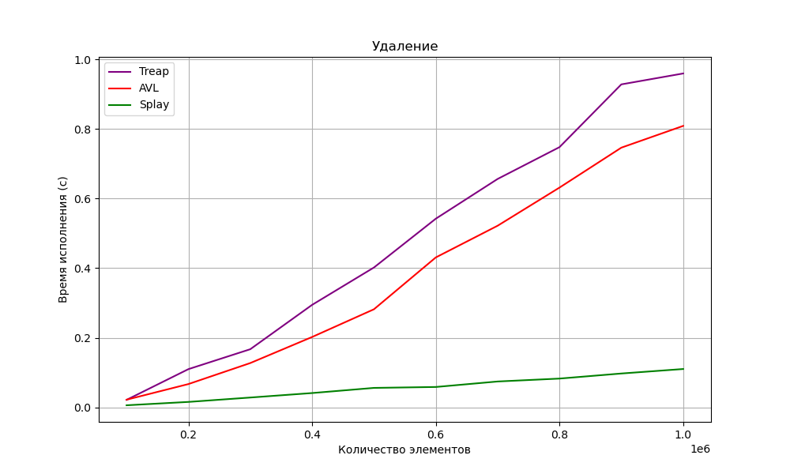

# Практическая работа 6. "Деревья"

## Пункт 1
Сравнение времени работы AVL-дерева и BST-дерева на (не)сортированном массиве размера 100 000 элементов.  
### Среднее время работы
BST-tree:
|     | Unsorted array: | Sorted_array: |
| :--- | :---: | :---: |
| Вставка: | 0.034649s | 48.045607s |
| Удаление: | 0.016180s | 10.350803s |  

AVL-tree:
|     | Unsorted array: | Sorted_array: |
| :--- | :---: | :---: |
| Вставка: | 0.051823s | 0.037247s |
| Удаление: | 0.024478s | 0.020240s |

## Пункт 2
Сравнение времени работы AVL-дерева, Splay-дерева, Декартова дерева на выбранном тесте.  

## Пункт 3
**Вывод**  
Сравнивая AVL-дерево с BST-деревом, получаем наглядно большую разницу во времени работы на сортированных массивах. Это объясняется вырождением дерева поиска в "бамбук":  
  1. При вставке для добавления узла каждый раз необходимо спускаться все ниже и ниже по правой ветви дерева  
  2. При рандомизированном удалении запрос на удаление больших значений также заставляет программу перебирать большое количество узлов правой ветви дерева.
AVL-дерево, засчет своей сбалансированности, при любой входной последовательности построит нам уравновешенное дерево без вырождений в "бамбук". Поэтому итерироваться по узлам в поиске значений мы будем гораздо меньшее время.

Если говорить о сравнении работы AVL, Treap, Splay стурктур, можно отметить, что более долгая работа Treap, вероятно, вызвана тем, что оно не использует повороты при построении и удалении. Сбалансированность ему дает сопоставление узлам приоритетов: по приоритетам это дерево является кучей, по ключам - обычное дерево поиска. При удалении и вставке используются слияния и разрезания по ключам, поиск которых занимает определенное время. Кроме того, чтобы корректно вернуть указатель на дерево, после совершенной операции вставки/удаления необходимо подниматься вверх к корню.  
