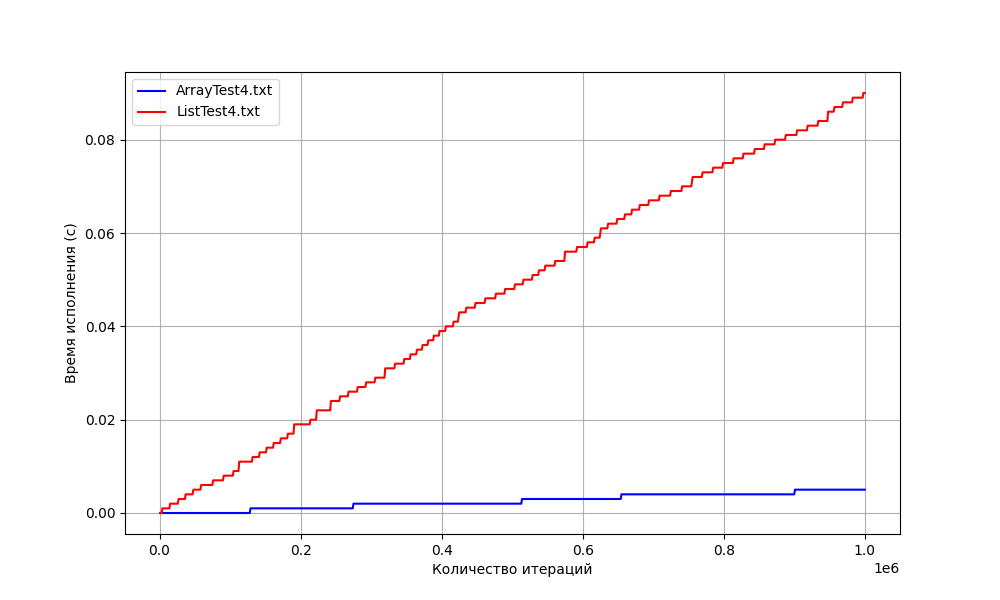

# Практическая работа 2. "Сравнение скорости работы динамического массива и односвязного списка"

## Среднее время работы по трём первым тестам
Стек на списке:  
list_test 1: 0.183000s  
list_test 2: 0.394000s  
list_test 3: 0.066000s  

Стек на массиве:  
array_test 1: 0.024000s  
array_test 2: 0.063000s  
array_test 3: 0.025000s  

## Вывод
Анализируя график, построенный при прохождении теста 4, сделаем вывод, что использование стека на массиве ***гораздо более эффективно***, нежели использование стека на списке.  

При малейшем увеличении количества итераций цикла вставки нового элемента в стек видим все большую разницу во времени исполнения в пользу структуры ArrStack. Также стоит помнить про память, которую потребляет используемый алгоритм. Отметим, что, очевидно, стек на листе ее потребляет в больших масштабах, нежели стек на массиве.
Итого вывод: **стек на массиве лучше как в плане времени работы, так и по объему потребляемой памяти**.
